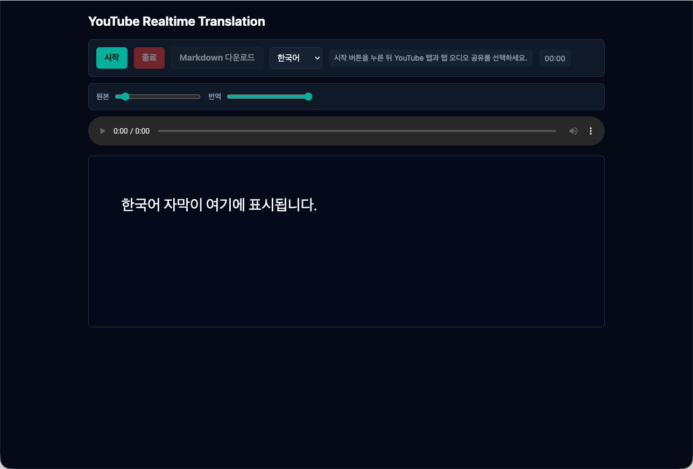

# LinguaForge

[한국어 README](README.ko.md)

[](https://nodejs.org/)
[](LICENSE)

Localhost proof of concept for live YouTube translation. LinguaForge captures audio from a Chrome tab, sends it to OpenAI Realtime Translation over WebRTC, plays translated audio, renders translated captions, and exports a Markdown transcript.

This repository is a PoC, not a production service. It is intentionally bound to loopback by default and keeps the OpenAI API key on the local server.

Useful search terms: OpenAI Realtime Translation, OpenAI Codex, WebRTC translation, YouTube live translation, Chrome tab audio capture, Korean captions, speech-to-speech translation, AI interpreter, realtime subtitles.



## What It Does

- Captures Chrome tab audio with `getDisplayMedia()`.
- Creates short-lived OpenAI Realtime Translation client secrets from a local Express server.
- Streams captured audio to `gpt-realtime-translate` over WebRTC.
- Plays translated audio in the browser.
- Shows translated captions.
- Provides original and translated audio volume controls.
- Supports manual stop, tab-ended stop, silence timeout, and max-session timeout.
- Exports the translated transcript as Markdown.

## Stack

- Node.js ESM
- Express
- Browser WebRTC APIs
- OpenAI Realtime Translation
- Chrome tab audio capture

## Built With Codex

This project was developed with OpenAI Codex as the coding agent. Public environment snapshot for this repository state:

- Agent: Codex, GPT-5-based coding agent
- Local environment: macOS 26.4.1, `zsh`, Asia/Seoul timezone
- Runtime checked with: Node.js `v24.7.0`, npm `11.5.1`
- App runtime: localhost Express server, default port `4000`
- Repository target: public GitHub project `rocosrex/LinguaForge`

## Quick Start

```bash
cd yt-translate-poc
npm install
cp .env.example .env
```

Edit `.env`:

```dotenv
OPENAI_API_KEY=sk-...
PORT=4000
HOST=127.0.0.1
```

Run:

```bash
npm start
```

Open:

```text
http://127.0.0.1:4000
```

In Chrome, click `Start`, select the YouTube tab, and make sure tab audio sharing is enabled.

## Security Notes

- `.env` is ignored and must not be committed.
- The server defaults to `127.0.0.1`.
- Unsafe bind hosts such as `0.0.0.0` are rejected.
- `/session` only accepts localhost Host/Origin values.
- The browser receives only a short-lived client secret, not the OpenAI API key.

## Verification Results

Latest automated test run:

```text
npm test
24 passed, 0 failed
```

Local smoke checks performed:

- Server started on `http://127.0.0.1:4000`.
- Static page loaded successfully.
- `/session` returned `200 OK` with a configured API key.
- Non-local Host was rejected with `403`.
- `HOST=0.0.0.0` was rejected before listen.
- Live browser translation was manually confirmed during PoC testing.

## Cost Note

The cost estimate is not reliable yet. During one rough manual run, the observed cost appeared to be around USD 10 for about 8 minutes, but the test was not isolated enough to publish that as a real benchmark. A controlled retest is needed before documenting expected cost per minute or per hour.

## Public Data Note

Raw YouTube transcript exports are intentionally not tracked in this public repository. The tracked comparison report in `test-output/` contains summarized evaluation notes rather than full source transcript dumps.

## Known Limitations

- `gpt-realtime-translate` currently uses dynamic voice adaptation, so translated voice color may shift during a session.
- Custom glossary, fixed voice selection, and custom prompting are not part of this PoC.
- Browser tests are source-contract tests; full WebRTC behavior still needs manual Chrome testing.
- Transcript export currently captures translated text only.

## License

MIT
